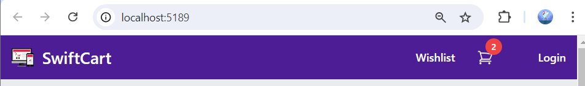
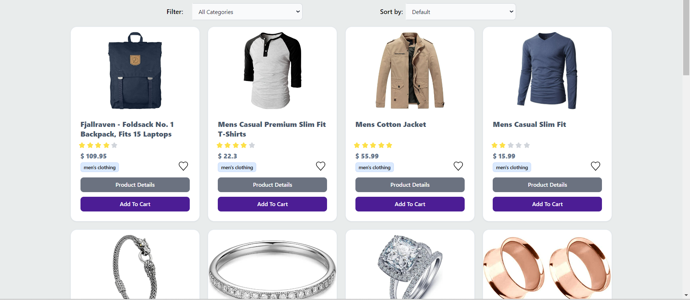
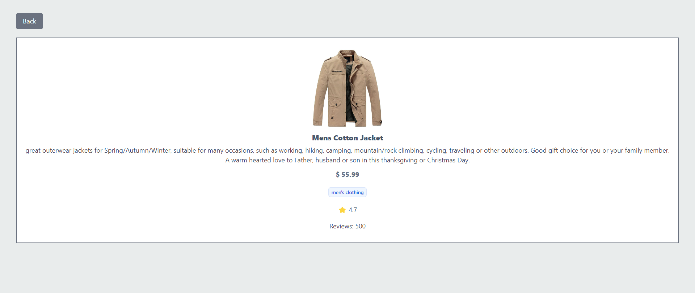

# 🏪 VUE CHALLENGE | JSF 04👔

## 🛒 Introduction

## 🤖 Technologies

## Setup Instructions 🚀

## Usage Examples 🛍️
### Home Page 🏠
Navigate to the Home page by clicking on the Logo to view a grid of available products.

### Filter by Category & Sort by Price 🔍
Use the filtering and sorting options to find products:

Filter by Category: Select a category from the "Filter" dropdown to display products from that category only.
Sort by Price: Choose an option from the "Sort by" dropdown to sort products by price (low to high, high to low, or default).

### Viewing Product Details 🛒
Click the `Product Details` button to view detailed information, including the image, title, price, category, rating, and description. A dedicated Product Detail page is provided, with a back button to return to the Home page.

