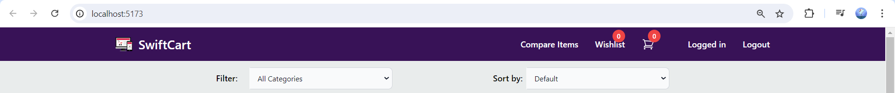
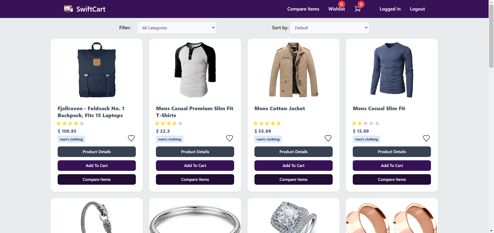
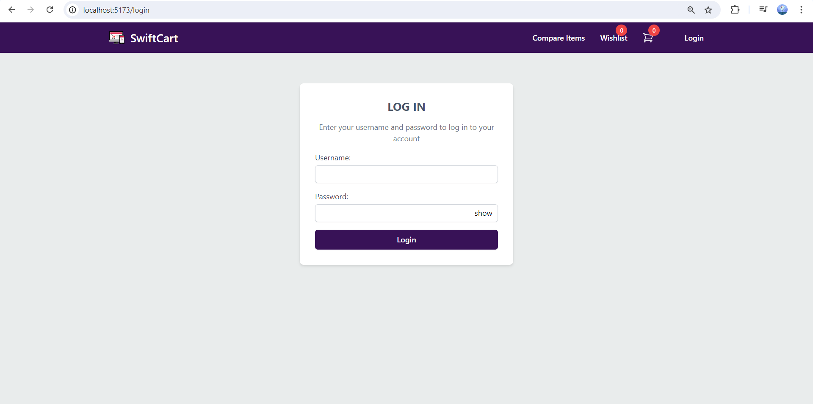
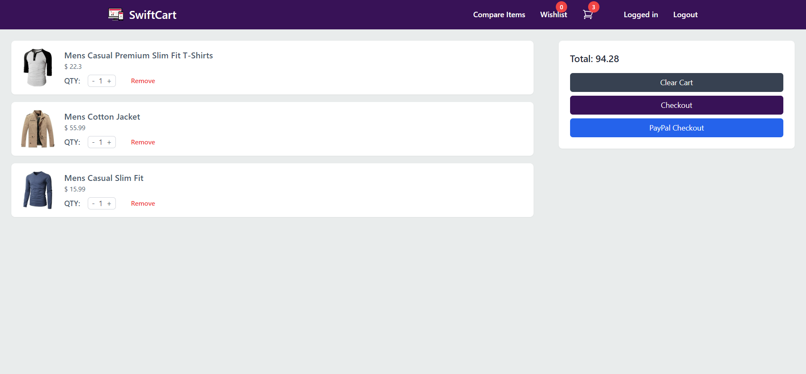
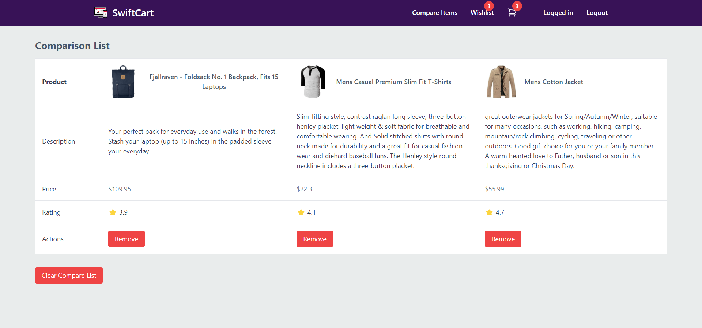
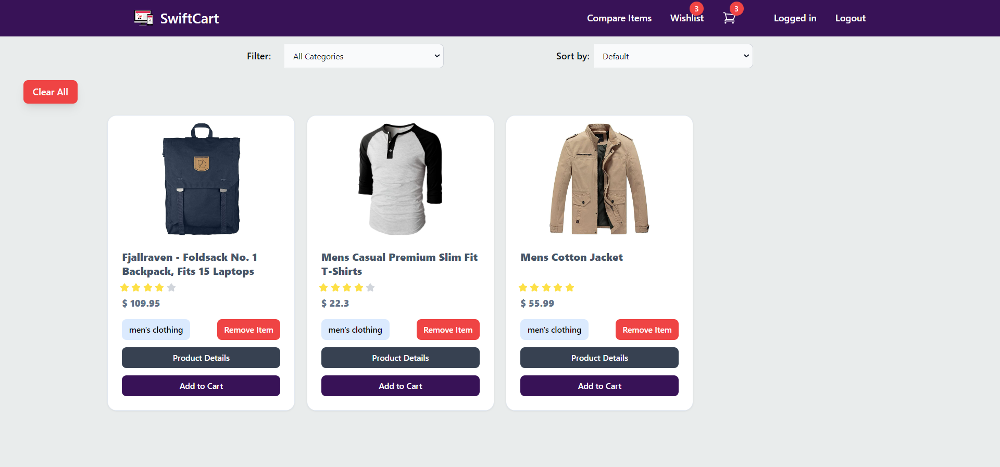

# 🏪 VUE CHALLENGE | JSF 04👔

## Link to Deployed App
[Deployed App](https://her-ecommerce-app.netlify.app/)

## Presentation Link
[JSF04 Presentation](https://youtu.be/NkFP9tmcN40)

## 🛒 Introduction
In this project, I built an e-commerce application to test my skills with VUe. It offers a smooth browsing experience, quick loading times, and an attractive design using Vue's efficient reactivity and component-based architecture.

## 🤖 Technologies
- HTML: Structuring components and pages.
- CSS3: Styling with Tailwind CSS for a utility-first approach.
- JavaScript: Managing logic, interactions, and API requests.
- Vue.js: Framework for building the app's user interface with a reactive and component-based approach.
- Pinia: For state management, handling data such as product lists and applied filters, add to cart, wishlist and comparelist.
- Vuex: For state manangement, handling login data.
- Vite: A build tool for fast development and efficient bundling.
- Fakestore API: A free API providing e-commerce product data.

## Setup Instructions 🚀
1. Clone the Repository & Open Terminal
2. Install Dependencies: `npm install`
3. Start the Development Server: npm run dev
4. View the Live App: Follow the provided link to see the application in action.

## Usage Examples 🛍️
### Home Page 🏠
Navigate to the Home page by clicking on the Logo to view a grid of available products. Each grid has product details and buttons. 

### Filter by Category & Sort by Price 🔍
Use the filtering and sorting options to find products:

Filter by Category: Select a category from the "Filter" dropdown to display products from that category only.
Sort by Price: Choose an option from the "Sort by" dropdown to sort products by price (low to high, high to low, or default).

### Viewing Product Details 📃
Click the `Product Details` button from the Home page to view detailed information, including the image, title, price, category, rating, and description. A dedicated Product Detail page is provided, with a back button to return to the Home page.

### Login Page 🔏
Click the `Login` button on the Navigation bar to access the login page and login. Username & Password from Fakestore API. Both inputs must be filled. Toggle the visibility of the password with the the `hide` and `show` button. Logout option is displayed on the navigation after logging in.

### Shopping Cart 🛒
Click the `Add to Cart` button on the product grids in the home page to add items to the Shopping cart. User can only access the Cart when logged in. Access the Shopping cart from the navigation bar to view products added. In the cart page, the user can increase & decrease the quantity, remove the product and clear the cart. The total is also displayed. Navigation to the checkout page is also included.

### Comparison List 4️⃣
Click the `Add to Compare` button on the product grids in the home page to add items to the Comparison List. User can only access the Comparison list when logged in. Access the compare Items List page from the navigation bar to view products added. In the page, Items with detailed information are displayed in a side by side table with a limit of 4 items.

### Wishlist ❤️
Click the `heart` button on the product grids in the home page to add items in the wishlist. User can only access the wishlist when logged in. Access the Wishlist page from the navigation bar to view products added. In the page, Items with detailed information are displayed in a grid with options to remove the item, add it to the cart, view product details, filter and sort products or clear products

